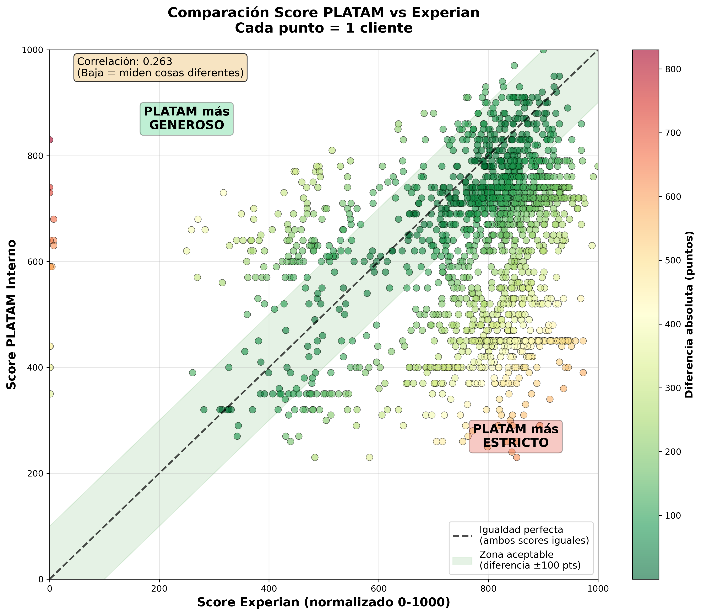
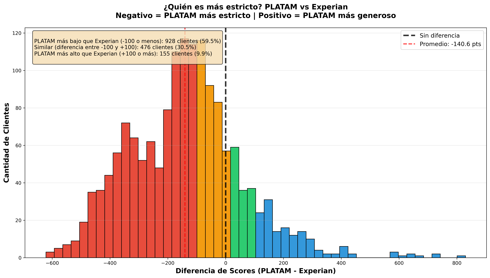

# PLATAM Internal Credit Score System

Sistema de scoring crediticio interno para PLATAM BNPL (Buy Now Pay Later) con migración planeada a Machine Learning usando Google Vertex AI.

[](https://www.python.org/)
[]()
[]()

---

## 📋 Tabla de Contenidos

- [Estado del Proyecto](#-estado-del-proyecto)
- [Inicio Rápido](#-inicio-rápido)
- [Documentación](#-documentación)
- [Resultados Clave](#-resultados-clave)
- [Estructura del Proyecto](#-estructura-del-proyecto)
- [Scripts Disponibles](#-scripts-disponibles)
- [Próximos Pasos](#-próximos-pasos)

---

## 🎯 Estado del Proyecto

**Fase Actual:** Scoring Basado en Reglas (Completado ✅)

| Fase | Estado | Completitud |
|------|--------|-------------|
| 1. Análisis de Datos | ✅ Completado | 100% |
| 2. Limpieza y Merge | ✅ Completado | 100% |
| 3. Scoring PLATAM | ✅ Completado | 100% |
| 4. Comparación con Experian | ✅ Completado | 100% |
| 5. Visualizaciones | ✅ Completado | 100% |
| 6. Ajustes y Optimización | ⏳ Pendiente | 0% |
| 7. Migración a ML (Vertex AI) | 📋 Planeado | 0% |

---

## 🚀 Inicio Rápido

### Requisitos

```bash
Python 3.8+
pandas
numpy
matplotlib
seaborn
boto3 (para S3)
```

### Instalación

```bash
# Clonar repositorio
git clone https://github.com/jpchacon09/Scoring-Interno-Platam.git
cd Scoring-Interno-Platam

# Instalar dependencias
pip install pandas numpy matplotlib seaborn boto3 python-dotenv

# Configurar credenciales AWS (opcional - solo si usas S3)
cp config/.env.example config/.env
# Editar config/.env con tus credenciales
```

### Uso Básico

```bash
# 1. Limpiar datos
python scripts/01_clean_bnpl_data.py

# 2. Hacer merge de tablas
python scripts/02_merge_all_data.py

# 3. Calcular scores PLATAM
python scripts/03_calculate_platam_score.py

# 4. Generar visualizaciones
python scripts/05_generate_simple_charts.py
```

---

## 📚 Documentación

### 📖 Empieza Aquí

1. **[RESUMEN_EJECUTIVO.md](RESUMEN_EJECUTIVO.md)** ⭐
   - Resumen completo del proyecto
   - Hallazgos principales
   - Recomendaciones

2. **[GRAFICOS_EXPLICADOS.md](GRAFICOS_EXPLICADOS.md)** 📊
   - 6 gráficos visuales con explicaciones simples
   - Comparación PLATAM vs Experian
   - Fácil de entender

### 🔍 Análisis Detallado

3. **[SCORE_COMPARISON_ANALYSIS.md](SCORE_COMPARISON_ANALYSIS.md)**
   - Análisis profundo de diferencias entre scores
   - Problemas identificados
   - Recomendaciones técnicas

4. **[DATA_MERGE_RESULTS.md](DATA_MERGE_RESULTS.md)**
   - Resultados del proceso de merge
   - Estadísticas de calidad de datos
   - Features generadas

### 📘 Documentación Técnica

5. **[PLATAM_SCORING_DOCUMENTATION.md](PLATAM_SCORING_DOCUMENTATION.md)**
   - Algoritmo de scoring explicado
   - 5 componentes del score (0-1000 puntos)
   - Fórmulas matemáticas

6. **[PLATAM_ML_MIGRATION_PLAN.md](PLATAM_ML_MIGRATION_PLAN.md)**
   - Roadmap completo a Machine Learning
   - Arquitectura en Vertex AI
   - Estimación de costos y ROI

7. **[PLATAM_TECHNICAL_ARCHITECTURE.md](PLATAM_TECHNICAL_ARCHITECTURE.md)**
   - Arquitectura técnica del sistema
   - Stack tecnológico
   - Flujo de datos

### 📝 Guías de Datos

8. **[DATA_ANALYSIS_AND_MERGE_STRATEGY.md](DATA_ANALYSIS_AND_MERGE_STRATEGY.md)**
   - Estrategia de merge de tablas
   - Análisis de relaciones
   - Cálculo de campos derivados

9. **[DATA_UPLOAD_GUIDE.md](DATA_UPLOAD_GUIDE.md)**
   - Guía para subir CSVs
   - Formato requerido
   - Validaciones

---

## 🎯 Resultados Clave

### Dataset Procesado

- **1,836 clientes** analizados
- **62 features** generadas
- **12,304 pagos** válidos ($10B COP)
- **84.9%** con score Experian (HCPN)
- **77.2%** con historial de pagos

### Hallazgos del Scoring

#### Distribución PLATAM Score

- **Promedio:** 617.6 puntos (Rating B-)
- **Rango:** 230 - 1000 puntos
- **10.6%** ratings A (Excelente)
- **41.2%** ratings B (Bueno)
- **28.9%** ratings D/F (Deficiente)

#### Comparación con Experian

| Métrica | PLATAM | Experian | Diferencia |
|---------|--------|----------|------------|
| **Promedio** | 621.5 | 762.1 | -140.6 |
| **Mediana** | 660.0 | 811.7 | -151.7 |
| **Correlación** | - | - | **0.263** |

**⚠️ Problema Identificado:** PLATAM es ~140 puntos más estricto que Experian. 47.2% de clientes tienen score PLATAM -150 puntos o menos vs Experian.

### Componentes del Score

| Componente | Promedio | % del Máximo | Estado |
|------------|----------|--------------|--------|
| Payment Performance | 282.8 / 400 | 70.7% | ✅ Bueno |
| Payment Plan History | 113.9 / 150 | 75.9% | ✅ Bueno |
| Deterioration Velocity | 69.0 / 100 | 69.0% | ⚠️ Regular |
| Purchase Consistency | 86.8 / 200 | 43.4% | ❌ Débil |
| Utilization | 65.1 / 150 | 43.4% | ❌ Débil |

---

## 📊 Vistazo Visual

### Comparación PLATAM vs Experian


*Cada punto = 1 cliente. La mayoría está debajo de la línea negra, indicando que PLATAM es más estricto que Experian. Correlación: 0.263 (baja).*

### Promedios por Rating


*Clientes con rating D/F según PLATAM tienen score Experian promedio de ~660-750 (Bueno). PLATAM está siendo muy conservador.*

### ¿Quién es más estricto?


*47.2% de clientes tienen PLATAM -150 puntos o menos vs Experian. Promedio: -140.6 puntos.*

### Análisis de Componentes


*Purchase Consistency y Utilization son los componentes más débiles (43.4%). Payment Performance es el más fuerte (70.7%).*

**Ver más:** [GRAFICOS_EXPLICADOS.md](GRAFICOS_EXPLICADOS.md) - 6 gráficos con explicaciones detalladas

---

## 📁 Estructura del Proyecto

```
Scoring-Interno-Platam/
│
├── 📄 README.md                          # Este archivo
├── 📄 RESUMEN_EJECUTIVO.md              # Empieza aquí
├── 📄 GRAFICOS_EXPLICADOS.md            # Visualizaciones explicadas
│
├── 📄 Documentación
│   ├── PLATAM_SCORING_DOCUMENTATION.md
│   ├── PLATAM_ML_MIGRATION_PLAN.md
│   ├── PLATAM_TECHNICAL_ARCHITECTURE.md
│   ├── DATA_ANALYSIS_AND_MERGE_STRATEGY.md
│   ├── DATA_MERGE_RESULTS.md
│   ├── DATA_UPLOAD_GUIDE.md
│   └── SCORE_COMPARISON_ANALYSIS.md
│
├── 📊 charts/                           # Gráficos generados
│   ├── 01_scatter_zonas.png
│   ├── 02_promedios_por_rating.png
│   ├── 03_diferencias_histogram.png
│   ├── 04_boxplot_comparativo.png
│   ├── 05_casos_extremos.png
│   └── 06_mapa_categorizacion.png
│
├── 📂 data/                             # Datos (excluidos de git)
│   ├── raw/                             # CSVs originales
│   ├── processed/                       # Datos procesados
│   │   ├── clientes_clean.csv
│   │   ├── pagos_clean.csv
│   │   ├── master_dataset.csv           # Dataset principal
│   │   ├── platam_scores.csv            # Scores calculados
│   │   └── score_comparison.csv         # Comparación
│   └── hcpn/                           # JSONs de HCPN (S3)
│
├── 🔧 scripts/                          # Scripts de procesamiento
│   ├── 01_clean_bnpl_data.py           # Limpieza
│   ├── 02_merge_all_data.py            # Merge
│   ├── 03_calculate_platam_score.py    # Scoring
│   ├── 04_visualize_scores.py          # Visualizaciones
│   ├── 05_generate_simple_charts.py    # Gráficos simples
│   ├── analyze_bnpl_data.py            # Análisis BNPL
│   ├── analyze_hcpn_data.py            # Análisis HCPN
│   └── download_hcpn.py                # Descarga S3
│
├── ⚙️ config/                           # Configuración
│   └── .env                            # Credenciales (no en git)
│
└── 🔒 .gitignore                        # Archivos excluidos
```

---

## 🛠️ Scripts Disponibles

### 1. Análisis Exploratorio

```bash
# Analizar datos BNPL
python scripts/analyze_bnpl_data.py

# Analizar datos HCPN (credit bureau)
python scripts/analyze_hcpn_data.py
```

### 2. Pipeline de Procesamiento

```bash
# Paso 1: Limpiar datos
python scripts/01_clean_bnpl_data.py
# Output: data/processed/*_clean.csv

# Paso 2: Merge de tablas
python scripts/02_merge_all_data.py
# Output: data/processed/master_dataset.csv

# Paso 3: Calcular scores
python scripts/03_calculate_platam_score.py
# Output: data/processed/platam_scores.csv
```

### 3. Visualizaciones

```bash
# Gráficos simples explicados
python scripts/05_generate_simple_charts.py
# Output: charts/*.png (6 gráficos)
```

---

## 📊 Visualizaciones Generadas

Ver **[GRAFICOS_EXPLICADOS.md](GRAFICOS_EXPLICADOS.md)** para explicaciones detalladas.

1. **Scatter Plot con Zonas** - Comparación visual PLATAM vs Experian
2. **Promedios por Rating** - ¿Qué dice Experian de tus ratings PLATAM?
3. **Histograma de Diferencias** - ¿Quién es más estricto?
4. **Boxplot Comparativo** - Distribuciones completas
5. **Casos Extremos** - Top 10 en cada dirección
6. **Mapa de Categorización** - ¿Coinciden las categorías?

---

## 🎓 Metodología de Scoring

### Algoritmo PLATAM (0-1000 puntos)

El score se calcula con 5 componentes:

1. **Payment Performance (400 pts)**
   - Puntualidad de pagos (DPD)
   - Patrón de pagos
   - Madurez del historial

2. **Purchase Consistency (200 pts)**
   - Frecuencia de compras
   - Recency (actividad reciente)

3. **Utilization Score (150 pts)**
   - % de utilización del cupo
   - Penaliza volatilidad extrema

4. **Payment Plan History (150 pts)**
   - Planes de pago activos
   - Perfil de riesgo

5. **Deterioration Velocity (100 pts)**
   - Comparación DPD reciente vs histórico
   - Tendencia de deterioro

### Ratings Crediticios

| Score | Rating | Interpretación |
|-------|--------|----------------|
| 900-1000 | A+ | Excelente |
| 850-899 | A | Muy Bueno |
| 800-849 | A- | Bueno+ |
| 750-799 | B+ | Bueno |
| 700-749 | B | Satisfactorio |
| 650-699 | B- | Aceptable |
| 600-649 | C+ | Regular+ |
| 550-599 | C | Regular |
| 500-549 | C- | Regular- |
| 450-499 | D+ | Deficiente+ |
| 400-449 | D | Deficiente |
| 0-399 | F | Muy Deficiente |

---

## 💡 Recomendaciones

### Corto Plazo (1-2 semanas)

1. **Ajustar componentes débiles**
   - Purchase Consistency: No penalizar tanto por baja frecuencia
   - Utilization: Ajustar curva óptima

2. **Implementar lógica de fallback**
   - Dar más peso a Experian para clientes con poco historial interno

3. **Recalcular scores** con ajustes

### Mediano Plazo (1-2 meses)

4. **Crear Score Híbrido**
   ```
   Hybrid = (PLATAM * 0.6) + (Experian * 0.4)
   ```

5. **Validar con datos de default reales**

### Largo Plazo (3-6 meses)

6. **Migración a Machine Learning en Vertex AI**

---

## 🔐 Seguridad y Privacidad

Los siguientes archivos **NO** se suben al repositorio:

- ❌ `export-*.csv` - Datos de clientes reales
- ❌ `data/processed/*.csv` - Datos procesados
- ❌ `config/.env` - Credenciales AWS
- ❌ `charts/*.png` - Gráficos (pueden regenerarse)

---

## 📞 Contacto

**Repositorio:** https://github.com/jpchacon09/Scoring-Interno-Platam

---

## 📄 Licencia

Privado - Uso interno exclusivo de PLATAM.

---

**Última actualización:** 19 de diciembre de 2025
**Versión:** 1.0.0
**Status:** Phase 1 Complete ✅

---

## 🎯 Quick Links

- 📊 [Ver Gráficos Explicados](GRAFICOS_EXPLICADOS.md)
- 📝 [Leer Resumen Ejecutivo](RESUMEN_EJECUTIVO.md)
- 🔍 [Análisis de Comparación](SCORE_COMPARISON_ANALYSIS.md)
- 🚀 [Plan de Migración a ML](PLATAM_ML_MIGRATION_PLAN.md)
